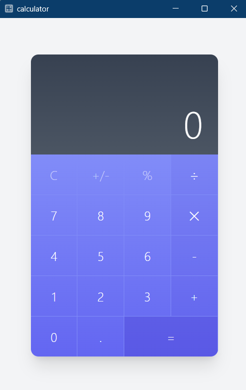

# Very Simple Calculator

This project was built for "Pelatihan RUST KMTETI 2024"



## Prerequisites (only for development)
https://tauri.app/v1/guides/getting-started/prerequisites

## Development
```sh
cargo tauri dev
```

## Credit:

UI for the calculator :\
https://tailwindcomponents.com/component/calculator-ui

Icon :\
[Google Fonts Icon](https://fonts.google.com/icons?selected=Material+Symbols+Outlined:calculate:FILL@0;wght@400;GRAD@0;opsz@24&icon.query=calculate&icon.size=24&icon.color=%23e8eaed)
